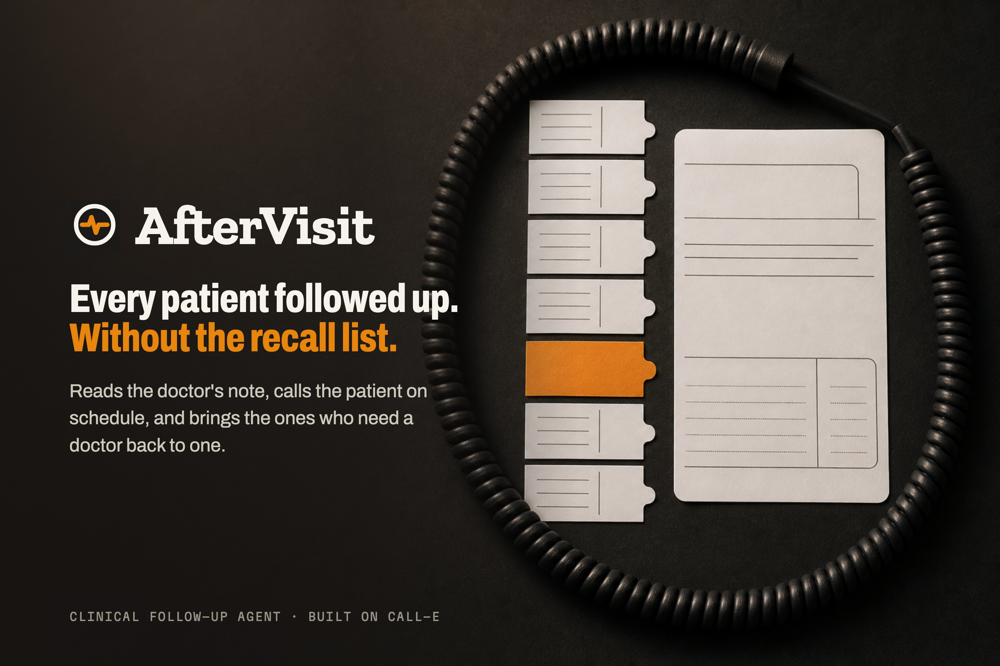
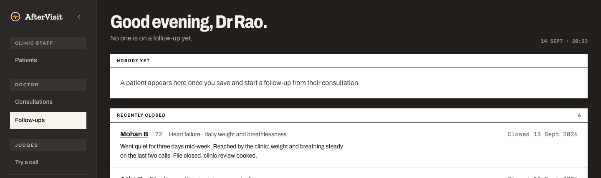
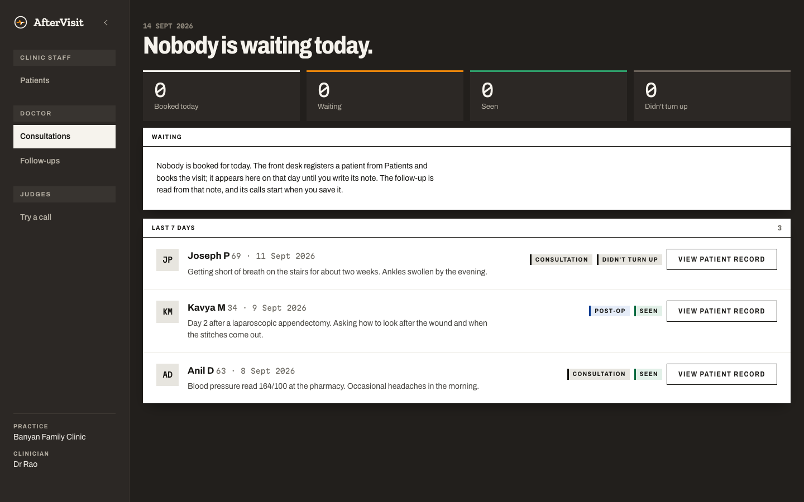
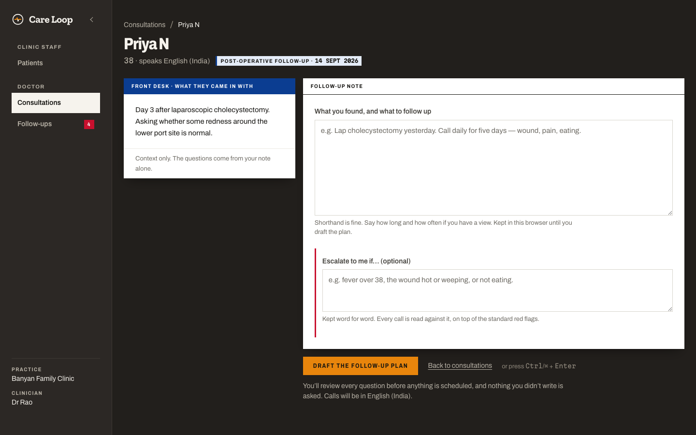
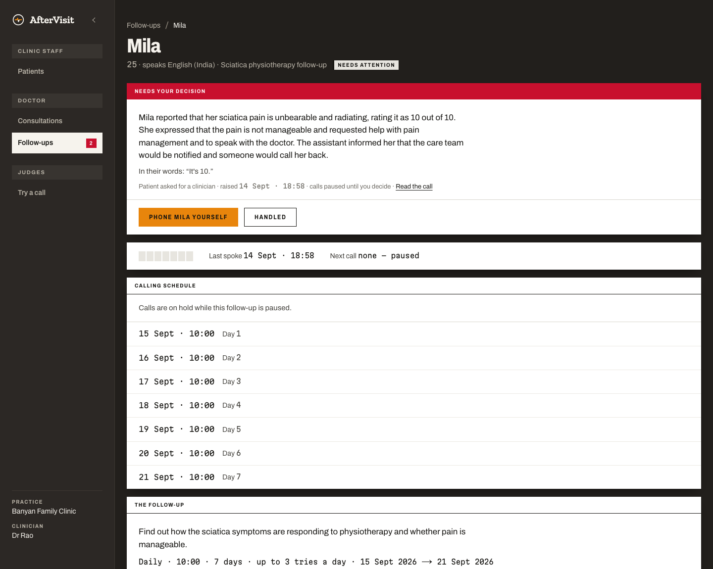

# AfterVisit

**A clinical follow-up agent built on CALL-E.** A doctor writes a free-form note after a
consultation and presses *Save and start follow-up*. AfterVisit reads the note into a goal, what
the doctor wants found out and a schedule; the agent then owns the whole workflow — scheduling,
calling, asking in its own words, extracting typed answers, retrying, escalating — until the
patient recovers or a clinician takes over.

The failure it exists to catch: **a patient who quietly stops engaging, and nobody notices
for a week.**

| | |
|---|---|
| **Live app** | https://aftervisit-calle.vercel.app — fictional `555-01xx` patients only; judges can ring their own phone with **Try a call** |
| **Demo video** | _link added on upload_ (under 3 minutes) |
| **Built for** | *CALL-E: Your Code Is Calling* hackathon |

> **This is a hackathon prototype. It is not for use with real patient data.** Every patient,
> clinician and clinic in this repository is fictional, and every committed phone number is in
> the US fiction-reserved `555-01xx` range.

## For judges

Every call from the live app is real: it rings a real phone and spends a CALL-E call. The
passcode for **Try a call** is in the **testing instructions of the Devpost submission**. It is
not in this repository.

1. **Hear one call — about two minutes.** Open https://aftervisit-calle.vercel.app and choose
   **Try a call** (top right, or *Judges* in the console's side rail). Enter the passcode, your
   first name, your number with its country code, and a language. Optionally paste a
   consultation note — for example *“Started amlodipine 5 mg for high blood pressure. Check for
   dizziness and ankle swelling.”* — and the call follows up on what it asks. Tick the consent
   box, press **Call**, and confirm. The assistant says it is an AI assistant, asks about each
   topic in its own words, and ends the call. The page then shows the recap, what each topic
   found out, anything a clinician should read, and the transcript. **Nothing is saved.**
2. **The workflow a doctor uses.** **Consultations** shows the last week's seen and missed
   visits; **Follow-ups** shows recently closed follow-ups with the doctor's summary. Open any
   patient to see the compiled plan — every value marked *from your note* or *default* — the
   calls on record, and what the patient said. Registering a patient with your own number,
   writing a note and pressing *Save and start follow-up* puts dated calls on the **Calling
   schedule**, where each can be moved, skipped, or placed now with **Try a call**.



---

## What it does

1. **The front desk registers the patient** and books the visit, recording once that they
   agreed to automated calls. Consent is the gate: nothing is ever dialled without it.
2. **The doctor writes the note** they would write anyway, plus an optional
   *“Escalate to me if…”*, kept word for word.
3. **The doctor presses *Save and start follow-up*.** That is their whole job. AfterVisit reads
   the note into a goal, up to five things to find out — each quoting the note’s own words —
   and a schedule. How long comes from the note (*“follow up for 3 days”*), otherwise 7 days,
   and so does a wait (*“recheck in 3 days”* is one call on day 3); how often, what time and
   retries come from the note or from defaults set in code, and the follow-up page says which.
   A topic that needs a number — a temperature, a pain score — asks for it, and the page shows
   the reading.
4. **The agent calls on schedule**, in the patient’s language, asks about each topic in its own
   words under fixed safety instructions, and **stops the call** the moment the patient
   describes something urgent or asks for the care team.
5. **The doctor’s Follow-ups board** shows how each patient is doing — not a call log. An
   escalation arrives with the patient’s own words; the doctor phones them and marks it handled.

| | |
|---|---|
|  |  |
| **Consultations** — the doctor’s day | **What the calls find out** — each topic quoted from the note, with the patient’s answer |
|  | |
| **The patient record** — the decision, the calling schedule, in their words | |

---

## Runs without placing calls

AfterVisit is **no-call by default**. Three independent locks each stop a dial:

| Lock | Default | What it does |
|---|---|---|
| `CALLE_API_KEY` | unset | No key, no calls. The follow-up page says so when a follow-up starts. |
| `AFTER_VISIT_CALL_ALLOWLIST` | **unset = locked** | Every dial is refused `not_allowlisted` until an operator lists numbers, or sets `*` for any consenting patient. |
| Patient consent | `unknown` | `dial()` refuses anyone whose consent is not an explicit `granted`. |

So a fresh clone, or a fresh deploy, rings nobody. **The hosted demo is the deliberate
exception:** it runs with a CALL-E key and the allowlist at `*` so judges can hear a call — so its whole
console sits behind a password (`AFTER_VISIT_CONSOLE_PASSCODE`, enforced in `proxy.ts`), and
nobody without it can register a patient or schedule a call. Consent is still required on every
dial, and the judges' Try a call sits behind its own `AFTER_VISIT_TRY_PASSCODE`. Treat it as a
demo, not a deployment.

To try it end to end without a phone:

```bash
cp .env.example .env          # set DATABASE_URL (Neon) and, for compiling notes, OPENAI_API_KEY
./start.sh --migrate --seed   # dev server on :3001; seeds a fictional practice
pnpm run verify               # tests, typecheck, lint — on zero credentials
```

The seeded practice has a full week of calls already on record — transcripts, triage summaries,
an escalation, a patient nobody reached — so every screen is populated without dialling. The
test suite exercises the whole call pipeline against `lib/calle/fake-server.ts`, an injectable
stand-in for CALL-E’s HTTP API.

### Opting in to a real call

Set `CALLE_API_KEY`, set `AFTER_VISIT_CALL_ALLOWLIST` to **your own number only**, register a
patient with that number and consent recorded, write a note and start the follow-up, and keep the Follow-ups page
open (it drives the scheduler), or run `./demo-tick.sh --every 5` to drive it from a terminal.
Calls cost money and reach real people.

## CALL-E features used

Every call goes through one file, `lib/calle/port.ts` — the only file that imports
`@call-e/calle`.

| Feature | Where | Why |
|---|---|---|
| `calls.create` | `lib/calle/port.ts` · `dial()` | Places each scheduled call, after the guard, E.164, consent and allowlist checks |
| `task` | `lib/script/build.ts` · `assembleTask()` | The goal and what to find out, with every safety instruction inlined — there is no mid-call tool calling |
| `resultSchema` | `lib/plan/result-schema.ts`, frozen when the follow-up starts | Fixed typed keys (reached, asked for a person, emergency, change, concern, goal covered) plus one nested `topic_n` object per thing to find out, with a `value` for a measured topic (closed unit list) |
| `recipientResultSchema` | `lib/calle/port.ts` | A fixed per-recipient shape (reached the patient, recap, anything else raised) |
| `metadata` | `lib/schedule/tick.ts` | `{ planId, occurrence, attempt }` — ties each call back to its plan row |
| `idempotencyKey` | `lib/db/ids.ts` + a unique index | One call per plan · occurrence · attempt, even if a tick retries |
| `webhookUrl` | `lib/schedule/tick.ts` | Optional; the receiver takes only a call id and **re-fetches** — webhooks are unsigned |
| `calls.get` | webhook receiver + reconciler | The authenticated source of truth for every result |
| `calls.waitForResult` | `lib/calle/port.ts` | Bounded wait used by the pipeline and tests |

Four properties of the API shape the design: **there is no endpoint to list calls** (every
call id is persisted before anything waits), **no mid-call tool calling** (everything the agent
may say is in the task), **no transactions on the Neon HTTP driver** (every race is one
conditional `UPDATE … RETURNING`), and **no scheduling API** (AfterVisit owns the calendar,
retries and escalation).

## How a follow-up happens

```
doctor's free-text note → "Save and start follow-up"
  → compile.ts    OpenAI structured output, strict schema, every defaultable field NULLABLE:
                  goal, what to find out (topic + note quote + unit), schedule + wait + quotes
                  → grounding.ts refuses any medication not present in the note
                  → defaults.ts fills gaps in code (7 days or one call after a wait,
                    daily, 10:00, 3 attempts)
                  → topic quotes checked against the note; guard phase 1 on goal and topics
  → plans.ts      startPlan → one scheduled_calls row per occurrence, dated from the wait
  → tick.ts       reconcile → atomic batch claim → goal task → guard → dial → persist call id
  → extract.ts    fixed result schema → typed answers + per-topic findings and readings
  → engine.ts     PURE evaluation of four locked conditions. No model. The floor
  → triage.ts     a model reads the transcript: severity, summary, the doctor's own
                  escalating conditions. Fails closed; never speaks to a patient
  → Follow-ups    the doctor sees how the patient is, why, and their own words
```

## The safety model

**The port is the only door.** Guard re-inspection, E.164 validation, consent and the dial
allowlist all live *inside* `dial()`, so no call site can skip them.

**Consent authorises a call; the allowlist authorises the deployment.** The scheduler dials
with nobody pressing a button, so the human gate moves earlier: the desk records consent and
the doctor presses *Save and start follow-up*. The allowlist answers a different question — may this instance
reach the outside world at all — and it is **closed by default**, because there is no login and
a stranger can record consent too.

**The guard is bidirectional and three-phase.** It rejects advice, diagnosis, dosage changes,
prognosis, false reassurance and anything attributed to the doctor — and it *also fails a script
missing* the AI disclosure, the emergency stop, the non-advice statement, the emergency handoff
or the human handoff. Phase 1 inspects the goal and each thing to find out when the note is
read — refusing advice and anything that directs the calling agent, anything longer than one
line, and a topic that shares no word with the note quote it claims — phase 2 the assembled task; phase 3 the transcript afterwards, agent turns only — which
matters more now that the agent phrases its own questions. (Phase 3’s patterns are English-only; for other call
languages the safety clauses stay enforced in the English task text that phases 1 and 2 check.)

**The model reads the call; four rules stand under it as a floor.** Triage reads the transcript
for severity and the doctor’s own conditions. Under it, `lib/rules/engine.ts` is four pure rules
— the patient asked for a person, emergency language, a reached call that did not find out
what it set out to (the agent’s own claim checked against its per-topic answers), nobody
answered — so a model outage degrades to *unjudged but still escalated*, never to silence.

**A reading is kept only when it is one.** A measured topic’s `value` is stored only when it
is a plain number, from a clearly answered topic, inside a plausible range for its unit;
*“about 38, I think”* or 101 recorded as °C stays in the patient’s words and never becomes a
number on the doctor’s screen.

**Uncertainty routes to a human.** Unmappable, unknown and missing are real statuses with a
real destination. Nothing is guessed to keep a loop closed.

**AfterVisit never gives clinical advice and never diagnoses.** Escalation is routing, never a
verdict. **Phone numbers are masked everywhere.**

## Stack

Next.js 16 (App Router, React 19) · TypeScript · Neon Postgres + Drizzle · CALL-E SDK ·
OpenAI (note compiler and call triage only) · Vitest for the pure, safety-bearing logic · plain
CSS tokens — no Tailwind, no component library.

## Layout

```
app/
  (console)/            Patients · Consultations · Follow-ups · one follow-up · one call
  api/tick/             the scheduler door for an external cron
  api/calle/webhook/    CALL-E's callback — takes a call id, re-fetches, never trusts
lib/
  calle/port.ts         the ONLY place that talks to CALL-E
  calle/fake-server.ts  offline stand-in so the suite runs with no API key
  plan/                 compile → defaults → grounding → result schema → extract
  script/               assembleTask (pure) and the three-phase clinical guard
  rules/                the four-rule floor, pure
  triage/               the model's reading of a finished call — fails closed
  schedule/             expand (pure) + store · tick · trigger
  db/                   Drizzle schema, queries, Neon client
data/                   seeded patients, demo notes, red-flag term lists
skills/aftervisit/       the installable agent skill: SKILL.md + references/
docs/DEMO.md            how the demo is recorded, scene by scene
```

## Agent skill

`skills/aftervisit/` packages the pattern independently of this codebase — read a clinician’s
note into a goal and grounded topics, run it as calls, and route every uncertain call to a person —
with safety rules and worked examples in `references/`.

## License

[MIT](LICENSE).
