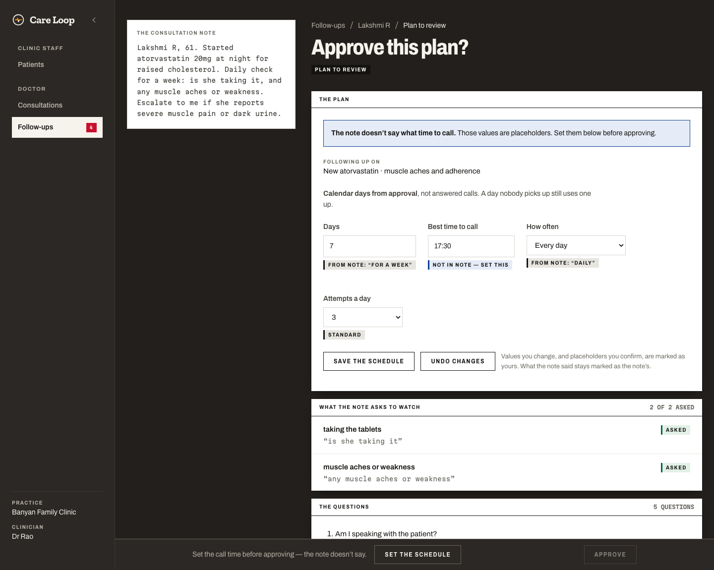

# Care Loop

**A clinical follow-up agent built on CALL-E.** A doctor writes a free-form note after a
consultation; Care Loop *compiles* it into a structured, reviewable follow-up plan; the doctor
approves it in one click; and the agent then owns the whole workflow — scheduling, calling,
extracting typed answers, retrying, escalating — until the patient recovers or a clinician
takes over.

The failure it exists to catch: **a patient who quietly stops engaging, and nobody notices
for a week.**

| | |
|---|---|
| **Live app** | https://careloop-calle.vercel.app — calls are locked, and it holds only fictional `555-01xx` patients |
| **Demo video** | _link added on upload_ (under 3 minutes) |
| **Built for** | *CALL-E: Your Code Is Calling* hackathon |

> **This is a hackathon prototype. It is not for use with real patient data.** Every patient,
> clinician and clinic in this repository is fictional, and every committed phone number is in
> the US fiction-reserved `555-01xx` range.


---

## What it does

1. **The front desk registers the patient** and books the visit, recording once that they
   agreed to automated calls. Consent is the gate: nothing is ever dialled without it.
2. **The doctor writes the note** they would write anyway, plus an optional
   *“Escalate to me if…”*, kept word for word.
3. **Care Loop compiles it** into a plan: how often, for how long, what time, what to ask.
   Every value is marked with where it came from — *From note: “daily”* — and a value the note
   never gave is marked for the doctor to set, never guessed.
4. **The doctor approves.** The agent calls on schedule, in the patient’s language, asks only
   the approved questions, and **stops the call** the moment the patient describes something
   urgent or asks for the care team.
5. **The doctor’s Follow-ups board** shows how each patient is doing — not a call log. An
   escalation arrives with the patient’s own words; the doctor phones them and marks it handled.

| | |
|---|---|
|  |  |
| **Consultations** — the doctor’s day | **The note** — free text, plus what should escalate |
|  |  |
| **The compiled plan** — every value says where it came from | **The patient record** — what changed, in their words |

---

## Runs without placing calls

Care Loop is **no-call by default**. Three independent locks each stop a dial:

| Lock | Default | What it does |
|---|---|---|
| `CALLE_API_KEY` | unset | No key, no calls. The approval screen says so beside the button. |
| `CARELOOP_CALL_ALLOWLIST` | **unset = locked** | Every dial is refused `not_allowlisted` until an operator lists numbers, or sets `*` for any consenting patient. |
| Patient consent | `unknown` | `dial()` refuses anyone whose consent is not an explicit `granted`. |

So a fresh clone, or a fresh deploy, rings nobody. To try it end to end without a phone:

```bash
cp .env.example .env          # set DATABASE_URL (Neon) and, for compiling notes, OPENAI_API_KEY
./start.sh --migrate --seed   # dev server on :3001; seeds a fictional practice
pnpm run verify               # tests, typecheck, lint — on zero credentials
```

The seeded practice has a full week of calls already on record — transcripts, triage summaries,
an escalation, a patient nobody reached — so every screen is populated without dialling. The
test suite exercises the whole call pipeline against `lib/calle/fake-server.ts`, an injectable
stand-in for CALL-E’s HTTP API.

### Opting in to a real call

Set `CALLE_API_KEY`, set `CARELOOP_CALL_ALLOWLIST` to **your own number only**, register a
patient with that number and consent recorded, approve a plan, and keep the Follow-ups page
open (it drives the scheduler), or run `./demo-tick.sh --every 5` to drive it from a terminal.
Calls cost money and reach real people.

## CALL-E features used

Every call goes through one file, `lib/calle/port.ts` — the only file that imports
`@call-e/calle`.

| Feature | Where | Why |
|---|---|---|
| `calls.create` | `lib/calle/port.ts` · `dial()` | Places each scheduled call, after the guard, E.164, consent and allowlist checks |
| `task` | `lib/script/build.ts` · `assembleTask()` | The whole script, with every safety instruction inlined — there is no mid-call tool calling |
| `resultSchema` | frozen at approval (`lib/db/schema.ts`) | Typed answers per approved question; the schema cannot drift mid-course |
| `recipientResultSchema` | `lib/calle/port.ts` | A fixed per-recipient shape (reached the patient, recap, anything else raised) |
| `metadata` | `lib/schedule/tick.ts` | `{ planId, occurrence, attempt }` — ties each call back to its plan row |
| `idempotencyKey` | `lib/db/ids.ts` + a unique index | One call per plan · occurrence · attempt, even if a tick retries |
| `webhookUrl` | `lib/schedule/tick.ts` | Optional; the receiver takes only a call id and **re-fetches** — webhooks are unsigned |
| `calls.get` | webhook receiver + reconciler | The authenticated source of truth for every result |
| `calls.waitForResult` | `lib/calle/port.ts` | Bounded wait used by the pipeline and tests |

Four properties of the API shape the design: **there is no endpoint to list calls** (every
call id is persisted before anything waits), **no mid-call tool calling** (everything the agent
may say is in the task), **no transactions on the Neon HTTP driver** (every race is one
conditional `UPDATE … RETURNING`), and **no scheduling API** (Care Loop owns the calendar,
retries and escalation).

## How a follow-up happens

```
doctor's free-text note
  → compile.ts    OpenAI structured output, strict schema, every defaultable field NULLABLE
                  → defaults.ts stamps provenance (note | default | clinician)
                  → grounding.ts refuses any medication not present in the note
                  → guard phase 1 on each question, individually, unmasked
  → review UI     defaults visibly marked; the doctor edits and approves
  → expand.ts     approved plan → one scheduled_calls row per occurrence, dated
  → tick.ts       reconcile → atomic batch claim → guard → dial → persist call id
  → extract.ts    CALL-E's structured result → typed answers; unmappable is a real status
  → engine.ts     PURE evaluation of four locked conditions. No model. The floor
  → triage.ts     a model reads the transcript: severity, summary, the doctor's own
                  escalating conditions. Fails closed; never speaks to a patient
  → Follow-ups    the doctor sees how the patient is, why, and their own words
```

## The safety model

**The port is the only door.** Guard re-inspection, E.164 validation, consent and the dial
allowlist all live *inside* `dial()`, so no call site can skip them.

**Consent authorises a call; the allowlist authorises the deployment.** The scheduler dials
with nobody pressing a button, so the human gate moves earlier: the desk records consent and
the doctor approves the plan. The allowlist answers a different question — may this instance
reach the outside world at all — and it is **closed by default**, because there is no login and
a stranger can record consent too.

**The guard is bidirectional and three-phase.** It rejects advice, diagnosis, dosage changes,
prognosis, false reassurance and anything attributed to the doctor — and it *also fails a script
missing* the AI disclosure, the emergency stop, the non-advice statement, the emergency handoff
or the human handoff. Phase 1 inspects each question; phase 2 the assembled script; phase 3 the
transcript afterwards, agent turns only. (Phase 3’s patterns are English-only; for other call
languages the safety clauses stay enforced in the English task text that phases 1 and 2 check.)

**The model reads the call; four rules stand under it as a floor.** Triage reads the transcript
for severity and the doctor’s own conditions. Under it, `lib/rules/engine.ts` is four pure rules
— the patient asked for a person, emergency language, an answer nobody could map, nobody
answered — so a model outage degrades to *unjudged but still escalated*, never to silence.

**Uncertainty routes to a human.** Unmappable, unknown and missing are real statuses with a
real destination. Nothing is guessed to keep a loop closed.

**Care Loop never gives clinical advice and never diagnoses.** Escalation is routing, never a
verdict. **Phone numbers are masked everywhere.**

## Stack

Next.js 16 (App Router, React 19) · TypeScript · Neon Postgres + Drizzle · CALL-E SDK ·
OpenAI (note compiler and call triage only) · Vitest for the pure, safety-bearing logic · plain
CSS tokens — no Tailwind, no component library.

## Layout

```
app/
  (console)/            Patients · Consultations · Follow-ups · plan review · one call
  api/tick/             the scheduler door for an external cron
  api/calle/webhook/    CALL-E's callback — takes a call id, re-fetches, never trusts
lib/
  calle/port.ts         the ONLY place that talks to CALL-E
  calle/fake-server.ts  offline stand-in so the suite runs with no API key
  plan/                 compile → defaults → grounding → result schema → extract
  script/               assembleTask (pure) and the three-phase clinical guard
  rules/                the four-rule floor, pure
  triage/               the model's reading of a finished call — fails closed
  schedule/             expand (pure) + store · tick · trigger
  db/                   Drizzle schema, queries, Neon client
data/                   seeded patients, demo notes, red-flag term lists
skills/care-loop/       the installable agent skill: SKILL.md + references/
docs/DEMO.md            how the demo is recorded, scene by scene
```

## Agent skill

`skills/care-loop/` packages the pattern independently of this codebase — compile a clinician’s
note into a reviewable plan, run it as calls, and route every uncertain answer to a person —
with safety rules and worked examples in `references/`.

## Author

Built by **Sharmila Raghu** ([@sharmilaraghu](https://github.com/sharmilaraghu)).

## License

[MIT](LICENSE).
